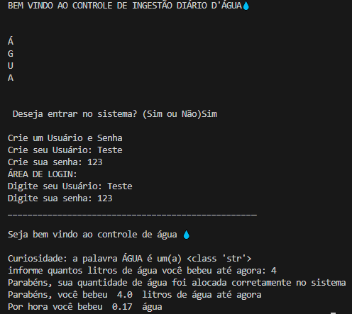
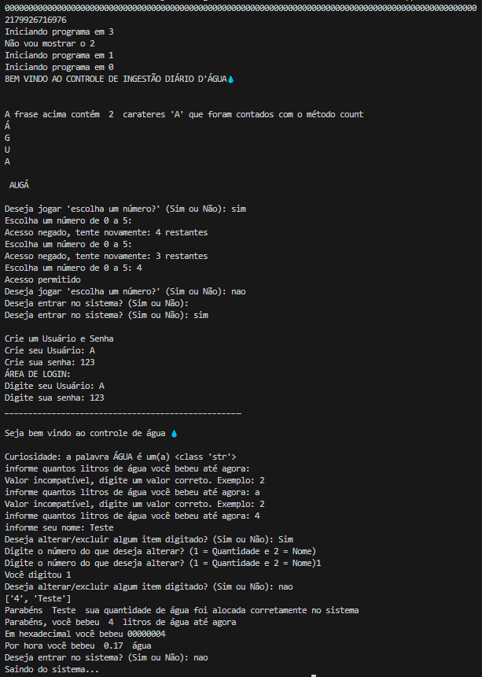
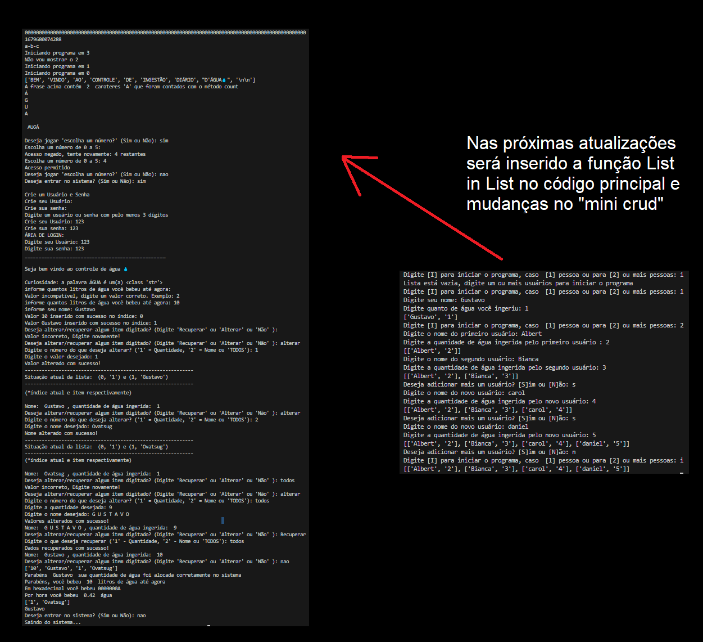

# 🐍 Projeto de Evolução em Python: do Básico ao Avançado

Este repositório tem como objetivo acompanhar meu processo de aprendizado em Python, começando do **zero**, com testes de **funções extremamente básicas**, e evoluindo gradualmente para soluções mais completas e complexas.

## 🚀 Objetivo

O foco principal é aprender na prática, desenvolvendo pequenos projetos que crescem em funcionalidade e dificuldade com o tempo. A ideia é construir uma base sólida de programação em Python, entendendo bem os fundamentos antes de avançar.

## 🗂️ Histórico de Versões

Nesta seção serão listadas as versões do projeto, com um breve resumo das mudanças e, sempre que possível, uma imagem demonstrando o funcionamento atual.

### 📌 Versão 2.10 – Entrada básica de consumo de água

📸 *Print da versão 2.10:*



---

📸 *Print da versão 2.20:*



---

📸 *Print da versão 2.30:*



---

### 🔜 Próximas versões

---

## 🧠 Estrutura de Evolução

O projeto será construído em **etapas**, onde cada fase adiciona novos conhecimentos, recursos e desafios.

### ✅ Etapa 1 - Lembrete para Beber Água (Versão Inicial)
- Um script **muito simples** que apenas pergunta ao usuário:
  > "Quanto de água você bebeu?"
- O objetivo dessa etapa é praticar:
  - Entrada de dados com `input()`
  - Tipos de dados básicos (`int`, `float`, `str`)
  - `print()` e concatenação de strings
  - Noções básicas de estrutura sequencial

### 🔄 Etapa 2 - Lembretes em Intervalos de Tempo *(em breve)*
- Adiciona funcionalidade para lembrar o usuário de beber água em intervalos regulares.
- Uso das bibliotecas `time` ou `datetime`.
- Introdução a estruturas de repetição (`while`, `for`).

### 🛠️ Etapas Futuras *(em planejamento)*
- Interface gráfica (Kivy, Tkinter ou similar).
- Configuração personalizada de horários.
- Armazenamento local dos registros de consumo.
- Notificações visuais ou sonoras.
- Exportação de dados (CSV, JSON).
- Gráficos de hábitos e evolução diária/semanal.
- Aplicativo executável ou versão para celular.

---

## 🌟 Expansões Futuras

O projeto também servirá de base para um **aplicativo multifuncional**, com várias ferramentas úteis do dia a dia, como:

- ⏱️ Avisar quanto falta para chegar ao seu ponto de ônibus
- 🙏 Lembrete de oração diária
- 🥗 Acompanhamento de dieta e refeições
- 🧠 Notas rápidas e controle de hábitos
- 💤 Aviso para horário de dormir
- 📅 Organização de tarefas simples

Todas essas funções serão implementadas de forma gradual, dentro de um único aplicativo principal, com foco em simplicidade, utilidade e aprendizado constante.

---

## 📦 Como Executar

1. Clone o repositório:
```bash
git clone https://github.com/GustavoD01/multifuncional.git
cd multifuncional
Ou acesse diretamente o arquivo principal aqui:  
👉 [lembrete_agua.py](https://github.com/GustavoD01/multifuncional/blob/main/lembrete_agua.py)
```
---

## 💡 Requisitos

- Python 3.x  
- *(No início, apenas bibliotecas padrão do Python)*

---

## 📚 Conceitos Explorados

- Entrada e saída de dados  
- Conversão de tipos  
- Estrutura sequencial  
- Laços de repetição e condicionais *(futuro)*  
- Modularização *(futuro)*  
- Interface gráfica *(futuro)*  
- Salvamento de dados e persistência *(futuro)*

---

## 📈 Progresso

O repositório será atualizado conforme o projeto evolui. Cada versão estará documentada em *commits* e separada por pastas ou arquivos nomeados conforme a etapa.

---

## 🧑‍💻 Autor

Desenvolvido por [Gustavo](https://github.com/GustavoD01) como parte do seu aprendizado contínuo em Python e Engenharia da Computação.